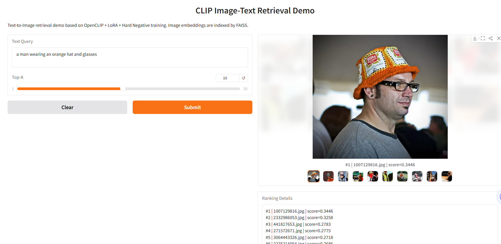

# CLIP Image-Text Retrieval with LoRA Fine-Tuning and Hard Negative Mining

This project implements an image-text retrieval system based on OpenCLIP. It supports zero-shot CLIP retrieval, LoRA-based parameter-efficient fine-tuning, hard negative training, FAISS indexing, and a Gradio demo for text-to-image search.

The project is designed as a multimodal retrieval project for internship preparation, focusing on contrastive learning, CLIP, Recall@K evaluation, hard negative mining, and retrieval system deployment.

## 1. Project Overview

Traditional CLIP-style dual-encoder retrieval relies on global image-text embeddings. While this is efficient, it may fail on fine-grained descriptions involving attributes, colors, clothing, actions, or visually similar negative samples.

This project improves a CLIP-based image-text retrieval baseline through:

* OpenCLIP zero-shot baseline reproduction
* Adapter-based fine-tuning
* LoRA parameter-efficient fine-tuning
* Hard negative mining and training
* Patch-token rerank exploration
* FAISS-based vector retrieval
* Gradio web demo

Final model:

```text
OpenCLIP ViT-B/32
+ LoRA fine-tuning
+ Hard Negative training
+ FAISS retrieval demo
```

## 2. Dataset

Dataset: Flickr30k

Split used in this project:

| Split | Images |
| ----- | -----: |
| Train | 29,000 |
| Val   |  1,014 |
| Test  |  1,000 |

Each image has 5 captions.

The dataset and image files are not included in this repository due to file size and license restrictions. Please download Flickr30k manually and place the files according to your local configuration.

Expected local structure:

```text
/root/autodl-tmp/
├── flickr_annotations_30k.csv
├── flickr30k-images/
└── model/
    └── open_clip_model.safetensors
```

## 3. Method

### 3.1 CLIP Baseline

The baseline uses OpenCLIP ViT-B/32 to extract normalized image and text embeddings.

```text
image → CLIP image encoder → image embedding
text  → CLIP text encoder  → text embedding

similarity = image_embedding · text_embedding
```

Retrieval is evaluated in both directions:

* Text-to-Image Retrieval
* Image-to-Text Retrieval

Metrics:

* Recall@1
* Recall@5
* Recall@10
* Mean Recall

### 3.2 LoRA Fine-Tuning

LoRA is inserted into the attention layers of both the image and text transformer modules. The original CLIP parameters are frozen, and only the LoRA parameters are updated.

This reduces trainable parameters while preserving the pretrained CLIP representation.

### 3.3 Hard Negative Mining

After LoRA fine-tuning, hard negatives are mined from the training split using model similarity scores.

Hard negatives are visually or semantically similar but incorrect image-text pairs. They help the model distinguish fine-grained differences.

The hard negative training objective combines:

```text
loss = CLIP contrastive loss + λ × hard negative loss
```

### 3.4 Patch-Token Rerank Exploration

A patch-token late interaction rerank method was also explored.

Process:

```text
global CLIP retrieval → Top-K candidates
→ image patch tokens + text token features
→ local patch-token similarity
→ final_score = global_score + α × local_score
```

However, validation experiments showed that this naive patch-token rerank method did not bring stable improvements. The best result occurred at α = 0, meaning the global CLIP score remained the strongest ranking signal.

This result is kept as an ablation study and failure analysis.

## 4. Main Results

Test set results on Flickr30k:

| Method               | T2I R@1 | T2I R@5 | T2I R@10 | I2T R@1 | I2T R@5 | I2T R@10 | Mean Recall |
| -------------------- | ------: | ------: | -------: | ------: | ------: | -------: | ----------: |
| CLIP Baseline        |   66.68 |   88.38 |    93.12 |   84.40 |   96.20 |    98.30 |       87.85 |
| Adapter Fine-tuning  |   69.76 |   90.42 |    94.76 |   86.80 |   96.40 |    98.60 |       89.46 |
| LoRA Fine-tuning     |   73.52 |   92.88 |    95.92 |   89.70 |   97.20 |    98.80 |       91.34 |
| LoRA + Hard Negative |   74.12 |   92.64 |    95.76 |   89.30 |   97.70 |    98.90 |       91.40 |

Compared with the zero-shot CLIP baseline:

```text
Mean Recall: 87.85 → 91.40
T2I R@1:     66.68 → 74.12
```

The final method improves Mean Recall by 3.55 points and Text-to-Image R@1 by 7.44 points.

## 5. Rerank Ablation

Validation set results:

| Alpha | T2I R@1 | T2I R@5 | T2I R@10 | I2T R@1 | I2T R@5 | I2T R@10 | Mean Recall |
| ----: | ------: | ------: | -------: | ------: | ------: | -------: | ----------: |
| 0.000 |   74.48 |   92.33 |    95.56 |   88.07 |   97.34 |    98.62 |       91.07 |
| 0.005 |   74.46 |   92.31 |    95.52 |   88.07 |   97.34 |    98.62 |       91.05 |
| 0.010 |   74.42 |   92.29 |    95.52 |   88.07 |   97.34 |    98.62 |       91.04 |
| 0.020 |   74.40 |   92.25 |    95.52 |   88.07 |   97.34 |    98.62 |       91.03 |
| 0.030 |   74.40 |   92.27 |    95.54 |   87.97 |   97.34 |    98.62 |       91.02 |

Conclusion: the naive patch-token rerank did not improve retrieval performance. Possible reasons include noise from function words, weak patch-level supervision, and mismatch between global and local similarity scales.

## 6. FAISS + Gradio Demo

The final model is used to build a text-to-image retrieval demo.

Offline stage:

```text
images → image embeddings → FAISS index
```

Online stage:

```text
text query → text embedding → FAISS search → Top-K images
```

Example query:

```text
a man wearing an orange hat and glasses
```

Top-1 result:

```text
1007129816.jpg, cosine similarity = 0.3446
```

This is a successful retrieval case because the image has the ground-truth caption:

```text
A man wears an orange hat and glasses.
```

Demo screenshot:


## 7. Project Structure

```text
clip-image-text-retrieval/
├── README.md
├── requirements.txt
├── .gitignore
├── src/
│   ├── baseline_clip_retrieval.py
│   ├── train_adapter_clip.py
│   ├── train_lora_clip.py
│   ├── train_hard_negative_lora.py
│   ├── eval_test_checkpoint.py
│   ├── rerank_patch_token_lora_fixed.py
│   ├── build_faiss_index.py
│   └── app_gradio.py
├── results/
│   ├── main_results.csv
│   └── rerank_ablation.csv
├── assets/
│   ├── demo_gradio_orange_hat.png
│   ├── success_case_1.png
│   ├── success_case_2.png
│   └── failure_case_1.png
└── docs/
    └── project_report.md
```

## 8. Environment

Main environment used:

```text
Python 3.10
PyTorch 2.1.2
CUDA 11.8
GPU: RTX 2080 Ti 11GB
```

Install dependencies:

```bash
pip install -r requirements.txt
```

Example `requirements.txt`:

```text
torch==2.1.2
torchvision
open_clip_torch
pandas
pillow
tqdm
numpy
faiss-cpu
gradio
```

## 9. How to Run

### 9.1 Run CLIP Baseline

```bash
python src/baseline_clip_retrieval.py
```

### 9.2 Train LoRA Model

```bash
python src/train_lora_clip.py
```

### 9.3 Train LoRA + Hard Negative Model

```bash
python src/train_hard_negative_lora.py
```

### 9.4 Evaluate Checkpoint on Test Set

```bash
python src/eval_test_checkpoint.py \
  --mode lora \
  --ckpt_path ./outputs_hard_negative/best_hardneg_lora.pt \
  --csv_path /root/autodl-tmp/flickr_annotations_30k.csv \
  --img_dir /root/autodl-tmp/flickr30k-images \
  --split test \
  --amp
```

### 9.5 Build FAISS Index

```bash
python src/build_faiss_index.py
```

### 9.6 Launch Gradio Demo

```bash
python src/app_gradio.py
```

Then open the displayed local URL or use port forwarding if running on a remote server.

## 10. Notes

The following files are not included in this repository:

* Flickr30k images
* OpenCLIP pretrained weights
* Fine-tuned checkpoints
* FAISS index files
* Extracted feature caches

These files are excluded by `.gitignore` due to file size and licensing constraints.

## 11. Future Work

Possible improvements:

* Use noun phrase filtering for patch-token rerank
* Add IDF or token-level weighting
* Train a lightweight cross-attention reranker
* Evaluate on MSCOCO or other image-text retrieval datasets
* Add more qualitative error analysis
